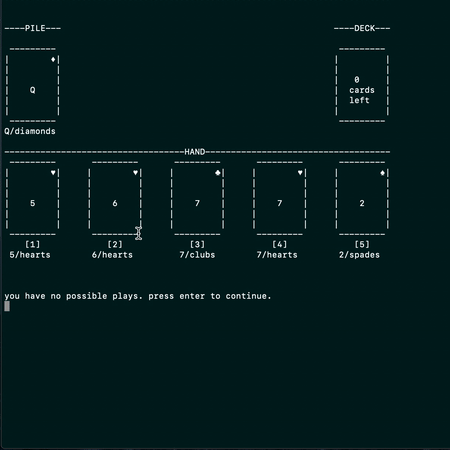
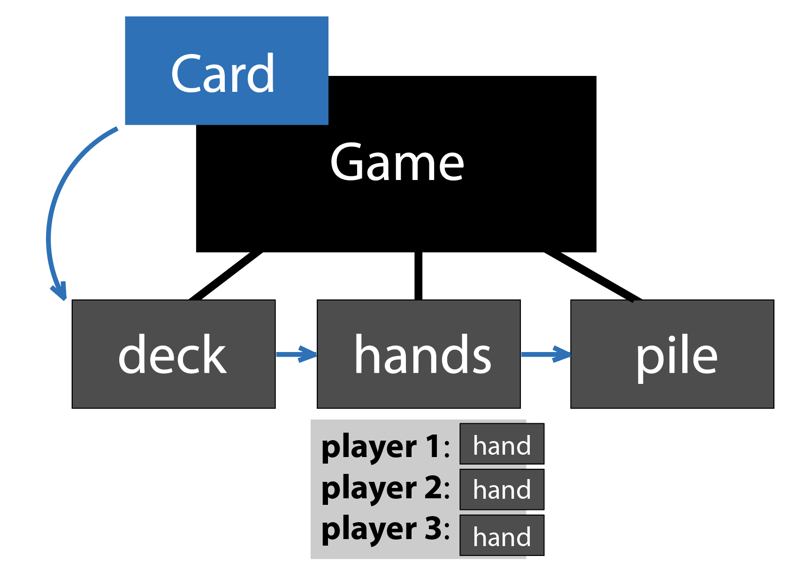

# Crazy Eights
This project is a terminal-run version of the popular children's card game, Crazy Eights.

_Description: demo of startup._

## Game setup
1. Download this project locally.
2. run `python3 crazy_eights.py` from your terminal.

## Rules 
**GAMEPLAY:**
- each player is dealt five cards.
- players will draw from the remaining deck.
- the top card of the deck is turned face up to start the discard pile next to it.
- in order, each player adds to the pile by playing one card, such that any of these are true:
	- the played card's suit matches the top card on the pile
	- the played card's value matches the top card on the pile
	- the played card's value is an eight
- a player who cannot fulfill any of these rules must draw cards from the deck until they can play one.
- till the deck is empty, all players must have 5 cards in their hands.
- when the draw pile is empty, a player who cannot add to the
 discard pile passes their turn.

**WIN CONDITIONS:**
- in a single-player game, the player must play all their cards to win.
- in a multiplayer game, the first player to discard all of their cards,
 or the players with the lowest amount of cards when there are no possible plays left, wins.
 

_Description: demo of win condition. We see that `bar` has less cards than `foo`, so `bar` has won._

- this game can be played with 1-5 players.

## Files
In this project, you'll find the following files:
- `crazy_eights.py`: the main Python script to run this game.
- `game.py`: called by `crazy_eights.py`; runs a game session. Contains `Game` class and functions.
- `draw.py`: draws card graphics, headers, and congratulatory messages.
- `card_actions.py`: performs various deck manipulations (shuffling deck, sorting cards into suits and values lists).
- `card.py`: describes `Card` object.
- `crazy_eights_unittest.py` performs unit tests for various functions. More info in *Testing* section.

## Code structure
- A `Game` has instance variables for the `deck`, `pile`, and `hands` objects.
- The `deck` is a queue of `Card`s, where the top card of the `deck` is the first element.
- The `pile` is a stack of `Card`s, where the top card of the `pile` is the last element.
- `hands` is a dictionary mapping player names to their respective `hand`s.
	- A `hand` is a list containing the `Card`s a player has.
- `Card`s have both `value` and `suit` attributes.

### Flow of Gameplay

_Description: a simple graphic of `card` flow during a game._

- `crazy_eights.py` will create a new instance of a `Game`.
- A `deck` of `Card` objects, created with all combinations of `suit`s and `value`s, is created and shuffled.
- An empty `pile` is instantiated.
- A `hands` object with player names corresponding to empty `hand`s is created.
- Cards from the `deck` are dealt to all players' `hand`s.
- While the game is active:
	- For each player:
		- Print the `deck`, `pile`, and their current `hand` on the terminal.
		- Check that there is at least one possible card that the player can put on the pile.
			- If not, the player must pass their turn.
			- If there is a possible play, the player plays the `Card` they choose on the `pile`.
- If no possible plays exist or one player has an empty `hand`, the game is not active anymore.
- Print the endgame situation (the cards left in each player's `hand`, the remaining `deck` if it exists, and the cards played in the `pile`).
- Print results (win/loss).

### Some reasoning of code structures
Among the coding decisions I made, I used:
- a set for `possible_plays` because set has _O(1)_ search and order is not required for `possible_plays`.
- a `Game` class for easy self-reference between subfunctions.
- `deck` queue and `pile` stack for intuitive interaction.
- string "pieces" in `draw.py` to "piece together" the UI, since it is terminal-based.

## Edge cases
The edge cases on the player input side that I accounted for include:

During startup:
- a non-integer input during "number of players" prompt.
- an out-of-bounds integer input during "number of players" prompt.
- repeated unique identifiers for players.

During gameplay:
- inputting a non-integer card index.
- inputting an integer card index that was out of bounds.
- inputting an integer card index that was an invalid play.

## Testing
Run `python3 crazy_eights_unittest.py` for testing.

Tests currently run inputs and parameters through some functions in `crazy_eights.py`, `game.py`, and `card_actions.py`.

I used the Python modules `unittest` and specifically `unittest.mock` because they're modules I've personally had experience with and because some of their structures (patching, mocking, parameterized testing) are convenient for isolation testing.

## Tooling
I used Python because it lends itself easily to creation of classes/objects (as an object-oriented language), because it comes with built in testing modules, and because it's the language I'm most familiar with.
