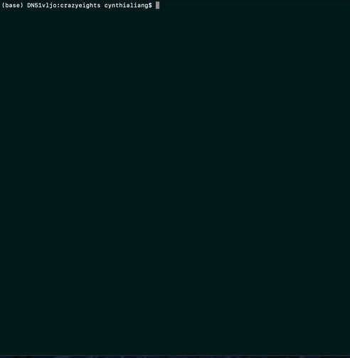

# Crazy Eights
This project is a terminal-run version of the popular children's card game, Crazy Eights.

## Game Setup
1. Download this project locally.
2. run `python3 crazy_eights.py` from your terminal.

## Rules 
*GAMEPLAY:*
- each player is dealt five cards.
- players will draw from the remaining deck.
- the top card of the deck is turned face up to start the discard pile next to it.
- in order, each player adds to the pile by playing one card, such that any of these are true:
	- the played card's suit matches the top card on the pile
	- the played card's value matches the top card on the pile
	- the played card's value is an eight
- a player who cannot fulfill any of these rules must draw cards from the deck until they can play one.
- till the deck is empty, all players must have 5 cards in their hands.
- when the draw pile is empty, a player who cannot add to the
 discard pile passes their turn.

*WIN CONDITIONS:*
- in a single-player game, the player must play all their cards to win.
- in a multiplayer game, the first player to discard all of their cards,
 or the players with the lowest amount of cards when there are no possible plays left, wins.

- this game can be played with 1-5 players.

## Code Structure
In this project, you'll find the following files:
*`crazy_eights.py`*: the main Python script to run this game.
*`game.py`*: called by `crazy_eights.py`; runs a game session. Contains `Game` class and functions.
*`draw.py`*: draws card graphics, headers, and congratulatory messages.
*`card_actions.py`*: performs various deck manipulations (shuffling deck, sorting cards into suits and values lists).
*`card.py`*: describes `Card` object.
*`crazy_eights_unittest.py`* performs unit tests for various functions. More info in *Testing* section.

## Testing
Tests can be found in `crazy_eights_unittest.py`. I used the Python modules `unittest` and `mock`, because they're modules I've personally had experience with, and they're quite convenient for running batch tests.
